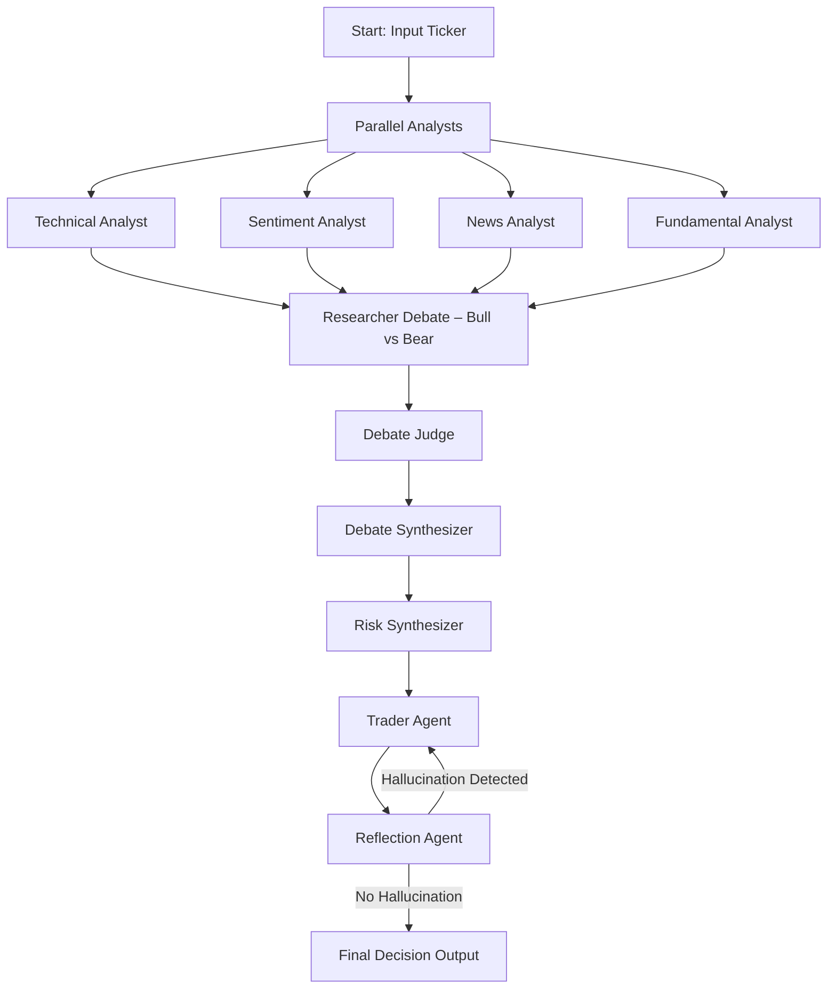

# AlphaForge

AlphaForge is a modular, multi-agent AI research and trading workflow built as a submission for the **Google Agent Development Kit Hackathon**. This project demonstrates how to orchestrate multiple specialized AI agents using the [Agent Development Kit](https://github.com/google/adk-python) and Google Cloud for robust, explainable, and automated financial decision-making.

---

## Key Features

- **Parallel Analyst Agents:** Technical, Sentiment, News, and Fundamental analysts run in parallel to generate comprehensive market reports.
- **Debate Simulation:** Bullish and Bearish researchers debate using LangGraph, with a judge and synthesizer agent providing verdict and summary.
- **Risk Synthesis:** Aggressive, Neutral, and Safe risk debators generate plans, which are synthesized into a strategic risk recommendation.
- **Trader Agent:** Makes a final actionable trading decision (BUY/HOLD/SELL) based on all synthesized insights.
- **Reflection Agent:** Checks the trader's decision for hallucinations or unsupported claims, ensuring reliability.
- **Automated Workflow:** The entire process is orchestrated in a single pipeline, with feedback loops for correction if hallucinations are detected.


---

## Workflow Overview



---

## Installation

1. **Clone the repository:**
    ```bash
    git clone https://github.com/SRINJOY59/Google-Agent-Development-Kit
    cd Google-Agent-Development-Kit
    ```

2. **Install dependencies:**
    ```bash
    pip install -r requirements.txt
    ```

3. **Set up your `.env` file** with the required API keys and environment variables for Google Cloud and Agent Development Kit.

---

## Usage

Run the main workflow with your desired ticker:

```bash

python Agents/workflow.py
```

Run the streamlit UI 

```bash
streamlit run app.py
```


You can customize the pipeline or run individual agents for testing and development.

---

## Project Structure

```
Google-Agent-Development-Kit/
│
├── Agents/
│   ├── Researcher/
│   ├── Analyst/
│   ├── Risk_Management/
│   ├── Trader/
│   ├── Reflection/
|   |── custom
|   |── app.py
│   └── workflow.py
├── README.md
├── requirements.txt
└── ...
```

---

## Customization

- Add or modify analyst agents for new data sources or asset classes.
- Extend the debate or risk synthesis logic for more complex scenarios.
- Integrate with real-time data feeds or trading APIs.
- Deploy on Google Cloud for scalable, production-grade agent orchestration.

---

## License

MIT License

---

**Submission for the Google Agent Development Kit Hackathon:**  
AlphaForge — Modular, explainable, and robust multi-agent AI for financial research and trading, built for the Agent Development Kit and